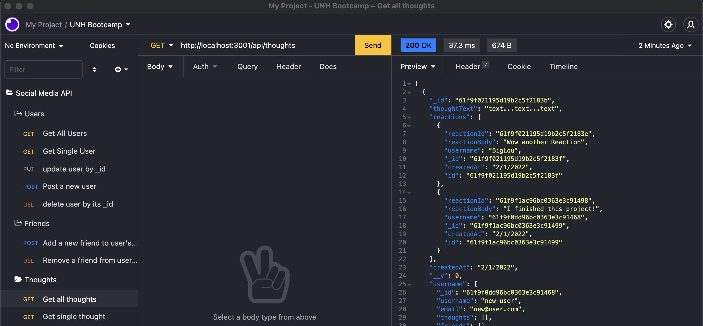

  
  
  # Social Network API
  ## Description
  Create a API system to manage a Social Network using MongoDB and Mongoose
  
  ## Table of Contents
  - [Installation](#installation)
  - [Usage](#usage)
  - [Contributing](#contributing)
  - [License](#license)
  - [Questions](#questions)
  ## Installation
  npm i
  ## Usage
  node index.js

## Testing

None

## Contributing

Open Source

## License

This project is protected under MIT License.

[License Documentation](https://opensource.org/licenses/MIT)

## Questions

[Refer to Github Profile: tallen1985](http://www.github.com/tallen1985)

Any additional questions, reach me at my email jake.allen@me.com

## Links and Screenshot

[Github Repository](https://github.com/tallen1985/18-Homework-Social-Network-API)

[Performance Video] (https://watch.screencastify.com/v/6SQy7oiImzn560uabBZo)

[
